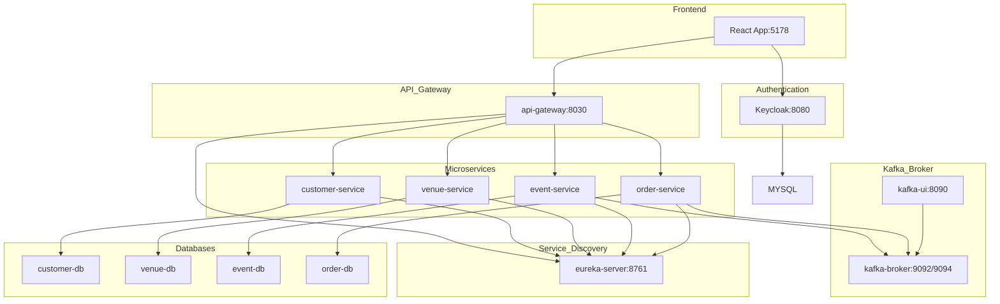

# Ticket Booking System - Microservices Architecture

A modern **venue-based ticket booking system** with microservices architecture. Users can browse venues, view events specific to each venue, and book tickets through an intuitive React frontend.

## System Overview

- **Venue-Based Navigation:** Users first browse venues, then explore events at specific venues
- **Service Discovery:** `eureka-server` registers and monitors microservices
- **API Gateway:** Routes external requests to microservices
- **Authentication:** Keycloak for secure user authentication and authorization
- **Message Broker:** Kafka (`kafka-broker`) for event-driven communication
- **Databases:** Each microservice has its dedicated MySQL database
- **Frontend:** React application with modern UI/UX
- **Microservices:** Customer, Venue, Event, and Order services

---

## Architecture Diagram



---

## Frontend Application

The frontend is a **React application** built with modern technologies:

- **React 19** with Vite for fast development
- **React Router** for navigation
- **Keycloak JS** for authentication integration
- **Custom CSS** with dark/light theme support
- **Venue-based UI** with intuitive navigation flow

### Key Features

- **Public Venue Browsing:** Users can browse all available venues
- **Event Discovery:** Click venues to view their specific events
- **Modal Authentication:** Clean login/register modal overlay
- **Responsive Design:** Works on desktop and mobile devices
- **Real-time Updates:** Live capacity and pricing information

---

## Getting Started

### Prerequisites

- Docker and Docker Compose
- Node.js 18+ (for frontend development)
- Maven (for backend services)

### Quick Start

1. **Start Infrastructure Services:**
   ```bash
   docker-compose up -d
   ```

2. **Start Microservices** (in separate terminals):
   ```bash
   # Service Discovery
   cd eureka-server && mvn spring-boot:run
   
   # API Gateway
   cd api-gateway && mvn spring-boot:run
   
   # Microservices
   cd customer-service && mvn spring-boot:run
   cd venue-service && mvn spring-boot:run
   cd event-service && mvn spring-boot:run
   cd order-service && mvn spring-boot:run
   ```

3. **Start Frontend:**
   ```bash
   cd frontend
   npm install
   npm run dev
   ```

### Access Points

- **Frontend:** http://localhost:5178
- **Keycloak Admin:** http://localhost:8080 (admin/admin)
- **Kafka UI:** http://localhost:8090
- **API Gateway:** http://localhost:8030

---

## Development Workflow

1. **Venue Management:** Admin users can add/edit venues
2. **Event Creation:** Events are always linked to specific venues
3. **User Registration:** Customers can create accounts via Keycloak
4. **Ticket Booking:** Browse venues → Select venue → View events → Book tickets

The system ensures a **venue-first approach** where all events are contextualized within their venue locations.
